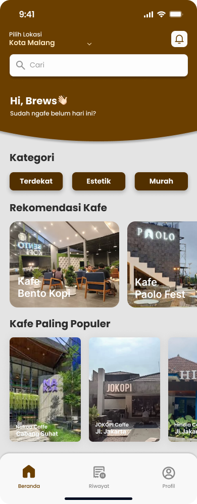
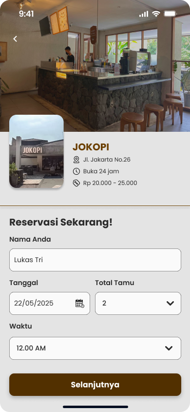
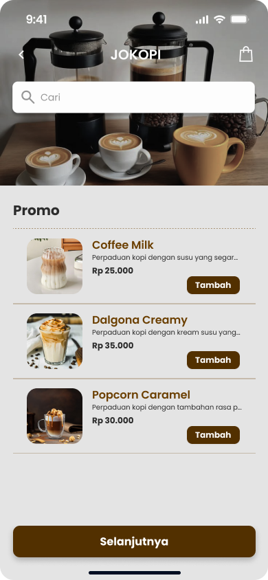
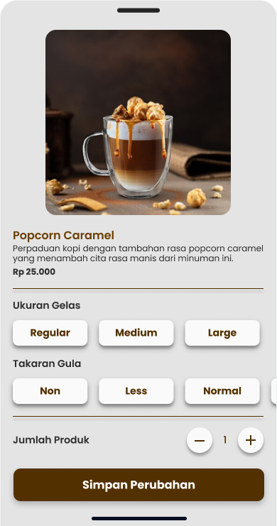
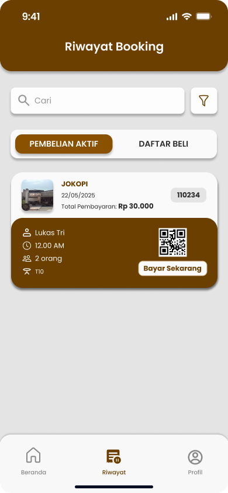
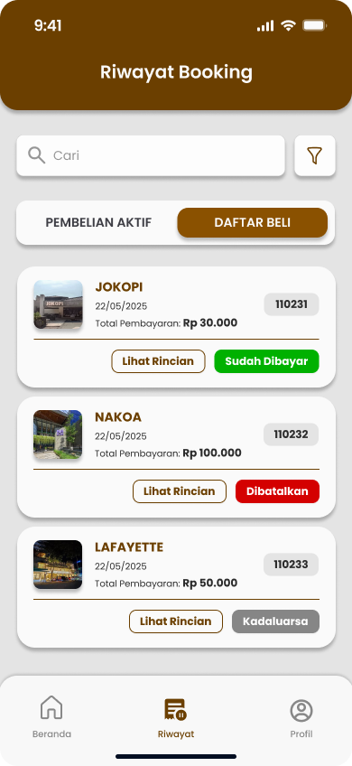
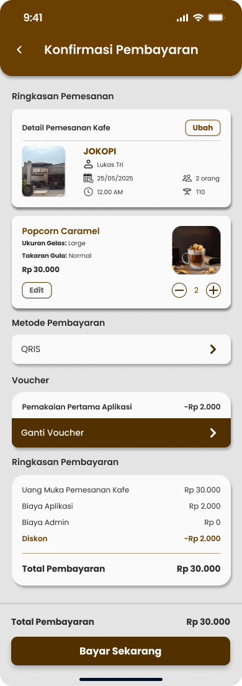

# 🌐 Project Domain
BrewSpot is an innovative café reservation application designed to streamline the booking experience for both customers and café owners. The platform features two main views: a User View for customers and an Admin View (also known as Café View) for café management. Through BrewSpot, users can reserve a table online with ease, supported by real-time visualizations such as photos and interactive café layouts. This allows customers to select their preferred seating area before arriving, enhancing comfort and convenience. For café owners, BrewSpot offers an efficient way to manage reservations and optimize seating arrangements through a digital dashboard.

# UI apk
## UserView
  
 
 
